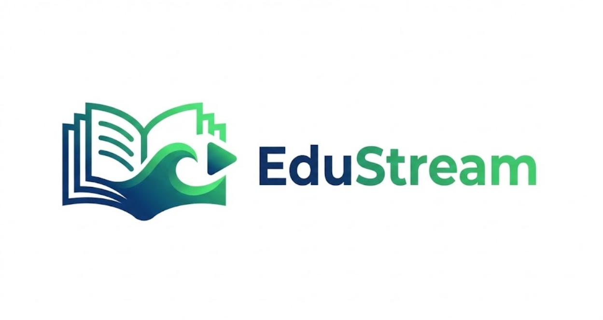

<div align="center">

<!-- PROJECT LOGO -->


# 🎓 EduStream Enterprise
### Hybrid Cloud Learning Management System


**Event-Driven. Scalable. Secure.**
<br>
<i>A next-generation video platform solving the "Thundering Herd" problem of traditional LMS architectures using Asynchronous Decoupling, Hybrid Compute, and Real-Time Push Notifications.</i>

[View Demo](#-live-demo-showcase) • [Architecture](#-system-architecture) • [Deployment](#-cloud-infrastructure-deployment)

</div>

---

## 📖 Executive Summary

**EduStream Enterprise** is not just another video player. It is a re-engineering of the Learning Management System (LMS) architecture to maximize fault tolerance and minimize cost.

Traditional monolithic LMS platforms crash during high-traffic exam uploads. EduStream solves this by implementing the **"Netflix Pattern"**:
1.  **Ingestion:** Decoupled from processing using **Amazon SQS** buffers.
2.  **Processing:** Offloaded to a dedicated **EC2 Deep Worker Node** inside a secure VPC.
3.  **Delivery:** Instant Feedback via **Firebase Cloud Messaging**.

---

## 🏗 System Architecture

The system moves beyond simple Serverless functions into a **Hybrid VPC Model**.


### The "Hybrid Bridge" Design
| Layer | Tech Stack | Responsibility |
| :--- | :--- | :--- |
| **Ingestion Layer** | **Flutter + S3** | Direct-to-Cloud Uploads using Signed URLs (Zero Server Load). |
| **Decoupling Layer** | **Amazon SQS** | Buffers incoming jobs. Acts as a traffic shock absorber. |
| **Secure Compute** | **EC2 + VPC** | Isolates the Python Worker Daemon (`worker.py`) in a private network. |
| **Notifications** | **Firebase (FCM)**| **Real-time Push Notification** triggered by the Backend Python Worker. |
| **Observability** | **CloudWatch** | Real-time dashboards (`DataIngestedMB`) and structured logging. |

---

## 🚀 Key Enterprise Features

### 1. Asynchronous Video Engineering ⚡
- **Problem:** AWS Lambda has a 15-minute timeout and lacks FFmpeg libraries.
- **Solution:** We deploy a persistent **EC2 Worker Node**.
- **Process:** It polls SQS, downloads raw video, generates thumbnails using **FFmpeg**, and writes metadata to DynamoDB.

### 2. Zero-Trust Security Architecture 🔒
- **VPC Isolation:** The Worker Node lives in a custom subnet (`10.0.1.0/24`) with strict Security Groups.
- **Runtime Secrets:** No API keys are hardcoded. The Python daemon fetches credentials dynamically from **AWS Secrets Manager** at runtime.

### 3. Real-Time Push Notifications (FCM) 🔔
- **Architecture:** We utilize **Firebase Cloud Messaging** in a Server-to-Client configuration.
- **Backend Role:** The Python Worker on EC2 is authenticated as a **Firebase Admin**. Upon successful video processing, it broadcasts a "High Priority" message payload.
- **Topic Subscription:** The Flutter Mobile App auto-subscribes to the `all_students` topic, ensuring instant delivery of "New Content Available" alerts to all active devices.

### 4. Automated DevOps Pipeline 🛠️
- **CI/CD:** GitHub Actions detects pushes to `main`.
- **Build:** Compiles Flutter Web using the HTML Renderer for speed.
- **Deploy:** Syncs artifacts to S3 Edge Locations automatically.

---

## 🛠 Tech Stack

<div align="center">

| **Category** | **Technology** | **Usage** |
| :--- | :--- | :--- |
| **Mobile/Web** |  | Unified Cross-Platform Client |
| **Alerts** |  | Push Notifications & Admin SDK |
| **Compute** |  | FFmpeg Transcoding Daemon |
| **Messaging** |  | Asynchronous Decoupling |
| **Database** |  | Single-Table NoSQL Design |
| **DevOps** |  | Automated Deployment |

</div>

---

## 💻 Cloud Infrastructure Deployment

This project uses **Infrastructure as Code (IaC)**. We do not manually create servers.

### Prerequisite
Detailed steps are provided in the `infrastructure.yaml` file.

### Step 1: Deploy Network Stack
Upload `infrastructure.yaml` to AWS CloudFormation.
- **Creates:** Custom VPC (`10.0.0.0/16`), Public Subnet, Internet Gateway, Security Groups.

### Step 2: Launch Compute Layer
Upload `compute.yaml` to AWS CloudFormation.
- **Bootstraps:** Automatically installs Python3, Boto3, and FFmpeg via UserData scripts.

### Step 3: Start the Daemon
SSH into the worker node and start the enterprise process:
```bash
# Connect to Secure Host
ssh -i "key.pem" ubuntu@<EC2-IP>

# Start Daemon in Background
nohup python3 worker.py > worker.log 2>&1 &
